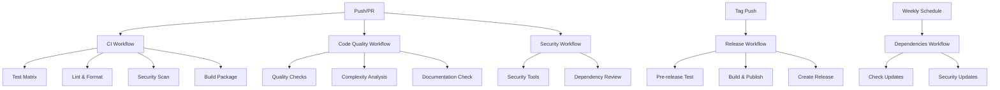

# GitHub Actions Workflows

This directory contains the CI/CD workflows for the ChatOps CLI project. These workflows automate testing, quality checks, security scanning, and releases.

## Workflows Overview

### 1. CI Workflow (`ci.yml`)
**Triggers**: Push to main/develop, Pull Requests
**Purpose**: Main continuous integration pipeline

**Jobs**:
- **Test**: Runs tests on Python 3.11, 3.12, 3.13 with coverage reporting
- **Lint**: Code formatting and linting checks (Black, Ruff, MyPy)
- **Security**: Security scanning with Bandit and Safety
- **Build**: Package building and artifact creation
- **Integration Tests**: Extended integration tests (main branch only)

**Features**:
- Matrix testing across Python versions
- Dependency caching for faster builds
- Coverage reporting to Codecov
- Artifact uploads for test results

### 2. Security Workflow (`security.yml`)
**Triggers**: Weekly schedule, Push to main, Pull Requests, Manual dispatch
**Purpose**: Comprehensive security scanning

**Jobs**:
- **Security Scan**: Multiple security tools (Bandit, Safety, Semgrep, Trivy)
- **Dependency Review**: Automated dependency vulnerability checks

**Features**:
- Weekly scheduled security scans
- PR comments with security findings
- Multiple security tool integration
- Artifact uploads for security reports

### 3. Release Workflow (`release.yml`)
**Triggers**: Tag push (v*)
**Purpose**: Automated releases and publishing

**Jobs**:
- **Test**: Pre-release testing
- **Build and Publish**: Package building and PyPI publishing
- **Notify**: Release notifications (optional Discord)

**Features**:
- Automatic PyPI publishing
- GitHub release creation
- Release notifications
- Comprehensive pre-release testing

### 4. Dependencies Workflow (`dependencies.yml`)
**Triggers**: Weekly schedule, Manual dispatch
**Purpose**: Dependency management and updates

**Jobs**:
- **Check Updates**: Automated dependency update PRs
- **Security Updates**: Security vulnerability fix PRs

**Features**:
- Weekly dependency update checks
- Automated PR creation for updates
- Security vulnerability monitoring
- Automated security fix PRs

### 5. Code Quality Workflow (`code-quality.yml`)
**Triggers**: Push to main/develop, Pull Requests
**Purpose**: Comprehensive code quality analysis

**Jobs**:
- **Code Quality**: Formatting, linting, type checking
- **Complexity**: Code complexity analysis
- **Documentation**: Documentation quality checks

**Features**:
- Multiple quality check tools
- Complexity analysis with Radon/Xenon
- Documentation coverage reporting
- Detailed quality reports

## Setup Requirements

### Required Secrets
```yaml
# For PyPI publishing
PYPI_API_TOKEN: Your PyPI API token

# For Discord notifications (optional)
DISCORD_WEBHOOK: Your Discord webhook URL

# For Codecov (optional)
CODECOV_TOKEN: Your Codecov token
```

### Environment Variables
The workflows use these environment variables:
- `PYTHON_VERSION`: Default Python version (3.11)

## Usage

### Manual Workflow Execution
You can manually trigger workflows from the GitHub Actions tab:
1. Go to Actions tab in your repository
2. Select the workflow you want to run
3. Click "Run workflow"
4. Choose branch and parameters
5. Click "Run workflow"

### Creating Releases
To create a new release:
1. Create and push a tag: `git tag v1.0.0 && git push origin v1.0.0`
2. The release workflow will automatically:
   - Run tests
   - Build the package
   - Publish to PyPI
   - Create a GitHub release

### Dependency Updates
The dependencies workflow runs weekly and will:
1. Check for outdated packages
2. Create PRs for non-security updates
3. Create high-priority PRs for security updates

## Workflow Dependencies



## Customization

### Adding New Python Versions
Edit the matrix in `ci.yml`:
```yaml
matrix:
  python-version: ["3.11", "3.12", "3.13", "3.14"]
```

### Adding New Security Tools
Add to `security.yml`:
```yaml
- name: Run New Security Tool
  run: |
    poetry run pip install new-security-tool
    poetry run new-security-tool scan .
```

### Modifying Test Commands
Update the test step in `ci.yml`:
```yaml
- name: Run tests with coverage
  run: |
    poetry run pytest --cov=chatops_cli --cov-report=xml --cov-report=html --cov-report=term-missing --cov-fail-under=85
```

## Troubleshooting

### Common Issues

1. **Poetry Installation Fails**
   - Check Poetry version compatibility
   - Verify Python version support

2. **Test Failures**
   - Check test dependencies
   - Verify test configuration in `pytest.ini`

3. **Security Scan Failures**
   - Review security tool configurations
   - Check for false positives

4. **Build Failures**
   - Verify `pyproject.toml` configuration
   - Check package structure

### Debugging Workflows

1. **Enable Debug Logging**
   Add to workflow:
   ```yaml
   env:
     ACTIONS_STEP_DEBUG: true
   ```

2. **Check Artifacts**
   - Download workflow artifacts
   - Review generated reports

3. **Local Testing**
   - Use `act` to test workflows locally
   - Install: `brew install act` (macOS) or download from releases

## Best Practices

1. **Keep Workflows Fast**
   - Use caching for dependencies
   - Parallelize independent jobs
   - Use matrix builds efficiently

2. **Security First**
   - Regular security scans
   - Dependency vulnerability monitoring
   - Automated security updates

3. **Quality Gates**
   - Enforce code quality standards
   - Maintain test coverage thresholds
   - Block merges on failures

4. **Documentation**
   - Keep workflow documentation updated
   - Document custom configurations
   - Maintain troubleshooting guides

## Contributing

When adding new workflows or modifying existing ones:

1. Test locally with `act`
2. Update this README
3. Add appropriate documentation
4. Consider backward compatibility
5. Update workflow dependencies if needed 